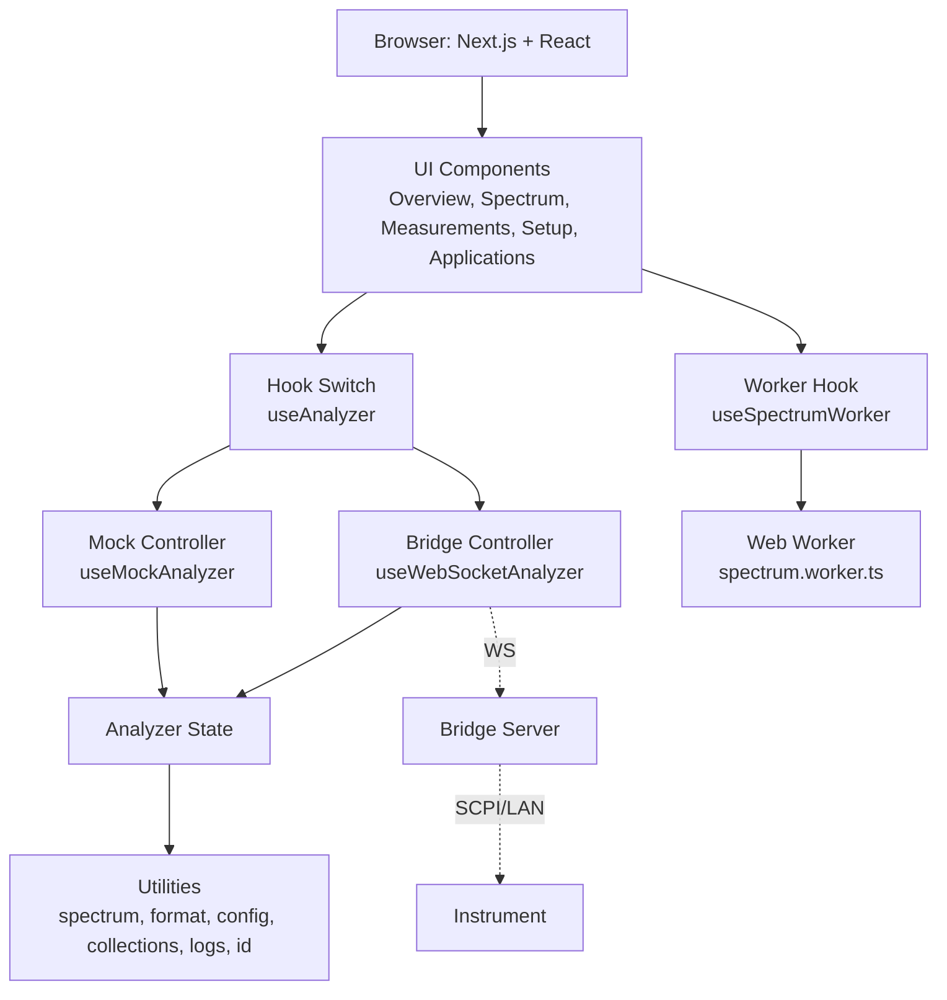

# NR5G Web UI (Spectrum Analyzer)

## Overview
- Next.js 15 + React 19 UI for a wideband spectrum analyzer demo (5G FR2 and dual‑path correlation).
- Runs out of the box with a realistic mock instrument. Optionally connects to a live analyzer via a lightweight WebSocket bridge when `NEXT_PUBLIC_ANALYZER_WS_URL` is set.

## Highlights
- Live wideband spectrum with peak markers and noise floor overlay.
- Marker controls: auto peak search, add/move/delete, SNR vs. noise floor.
- Trace memories with peak/floor and associated config snapshot.
- Measurements dashboard (EVM, DANL, TOI, ACLR, Noise Figure).
- Presets for 5G FR2, Satcom (Ka), Automotive Radar.
- 1RF / 2RF / Correlation path status and activity log.

## Screenshots

## Performance
- Spectrum math offloaded to a Web Worker for large traces.
- Automatic switch from SVG to Canvas rendering above 3k points (tunable).
- Overlay SVG for markers keeps interaction crisp while Canvas renders the trace.

## Tech Stack
- Next.js 15 App Router (TypeScript) — `src/app`; dev uses Turbopack (`next dev --turbopack`).
- React 19 — concurrent-ready components.
- TypeScript 5 — strict mode, `moduleResolution: bundler`, alias `@/*` (see `tsconfig.json`).
- Tailwind CSS v4 via `@tailwindcss/postcss` (configured in `postcss.config.mjs`); theme and tokens in `src/app/globals.css`.
- Zod for runtime schema validation of bridge messages (`src/app/bridge/schema.ts`).
- Vitest 2 (jsdom) + Testing Library for unit/component tests.
- ESLint 9 with `next/core-web-vitals` + TypeScript rules.
- Web Worker for spectrum processing (`src/app/workers/spectrum.worker.ts`) loaded via `new URL(..., import.meta.url)`.
- Canvas 2D renderer for large traces (`src/app/components/spectrum/CanvasSpectrum.tsx`) with SVG overlay for markers.

## Architecture

## Quick Start (Mock)
- Prereqs: Node.js 20+, npm 10+
- Install: `npm install`
- Dev: `npm run dev`
- Open: http://localhost:3000
- Click Connect → Start capture

Connect To A Real Analyzer
- Set `.env.local`:

  NEXT_PUBLIC_ANALYZER_WS_URL=ws://192.0.2.10:9000

- Restart `npm run dev`. The UI uses the WebSocket controller when this is set.

## Bridge Protocol
- Outbound (UI → bridge)
  - Handshake: {"type":"handshake","client":"nr5g-webui","version":"0.1.0"}
  - Acquisition: {"type":"command","command":"startCapture"|"stopCapture"}
  - Config patch: {"type":"config.update","payload": Partial<AnalyzerConfig>}
  - Preset recall: {"type":"preset.recall","preset":"5g-fr2"|"satcom"|"radar"}
- Inbound (bridge → UI)
  - Heartbeat: {"type":"heartbeat"}
  - Spectrum: {"type":"spectrum","payload": SpectrumTracePoint[]}
  - Measurements: {"type":"measurements","payload": AnalyzerMeasurement[]}
  - Config patch: {"type":"config","payload": Partial<AnalyzerConfig>}
  - Acquisition: {"type":"acquisition","payload":"idle"|"armed"|"capturing"}
  - State patch: {"type":"state","payload": Partial<AnalyzerState>}

Data Shapes
- Analyzer types: `src/app/types/analyzer.ts`
- Spectrum utils: `src/app/utils/spectrum.ts`
- Bridge schema (Zod): `src/app/bridge/schema.ts`

## Project Structure
- Entry: `src/app/page.tsx`
- Layout + styles: `src/app/layout.tsx`, `src/app/globals.css`
- Dashboard: `src/app/components/DashboardPage.tsx`
- Navigation: `src/app/components/SideNavigation.tsx`
- Overview: `src/app/components/OverviewView.tsx`
- Spectrum: `src/app/components/spectrum/SpectrumView.tsx`, `src/app/components/spectrum/CanvasSpectrum.tsx`
- Measurements: `src/app/components/measurements/MeasurementsView.tsx`
- Setup: `src/app/components/setup/SetupView.tsx`
- Apps: `src/app/components/applications/ApplicationsView.tsx`
- Hooks: `src/app/hooks/useAnalyzer.ts`, `src/app/hooks/useMockAnalyzer.ts`, `src/app/hooks/useWebSocketAnalyzer.ts`, `src/app/hooks/useSpectrumWorker.ts`
- Worker: `src/app/workers/spectrum.worker.ts`
- Mock: `src/app/mock/*`
- Utils: `src/app/utils/*`

## Rendering & Worker Details
- SVG path rendering for traces < 3k points.
- Canvas renderer for larger traces; markers and interactions remain SVG overlay.
- Worker computes bounds and noise floor; in Canvas mode it also returns screen‑space coordinates as a `Float32Array` for fast drawing.
- Threshold is defined in `src/app/components/spectrum/SpectrumView.tsx` (`CANVAS_THRESHOLD`).

## Scripts
- `npm run dev` — Start dev server
- `npm run build` — Production build
- `npm start` — Serve production build
- `npm run lint` — Lint
- `npm test` — Run tests (Vitest)

## Testing
- Run once: `npm test`
- Watch: `npm run test:watch`
- Single file: `npx vitest run tests/spectrum-utils.test.ts`
- Notes: Tests run in `jsdom` and don’t require the Next.js server to be running.

## Deployment
- Build with `npm run build`, then `npm start`.
- Provide `NEXT_PUBLIC_ANALYZER_WS_URL` in the environment if using a bridge.

## Troubleshooting
- “Bridge URL not configured” → add `NEXT_PUBLIC_ANALYZER_WS_URL` and restart dev server.
- No live spectrum → verify `spectrum` and `heartbeat` messages from the bridge; check browser console for WebSocket errors.
- Marker drag not working → ensure a trace is present and drag within the plot area.

## Roadmap
- Waterfall view (time history heatmap) for spectrum activity.
- Trace modes: max/min/peak hold, averaged trace, optional smoothing.
- Marker math: delta markers, span/center drag, channel power region, export marker table.
- Export: screenshots (PNG/SVG), trace CSV, measurements CSV/JSON; copy to clipboard.
- Persistence: save/restore layout, markers, and presets; auto‑restore last session (localStorage).
- Bridge hardening: auto‑reconnect with backoff, ping/pong keepalive, schema versioning; optional binary `Float32Array` spectrum frames; clearer error reporting.
- Accessibility: keyboard navigation, focus states, high‑contrast and reduced‑motion support.
- Additional measurements: channel power, occupied bandwidth (OBW), spurious search; thresholds/alarms with bookmarking.
- Interaction: drag‑zoom box, scroll zoom, pan, zoom‑to‑fit, snapping to peaks.
- Performance: OffscreenCanvas + transferable buffers; consider WebGL path for very large traces; worker chunking.
- Testing/CI: Playwright end‑to‑end and visual snapshot tests; CI for lint/test/build; bundle size budgets.
- Internationalization (i18n) and RTL layout; theme customization.

## License
- No license specified.
