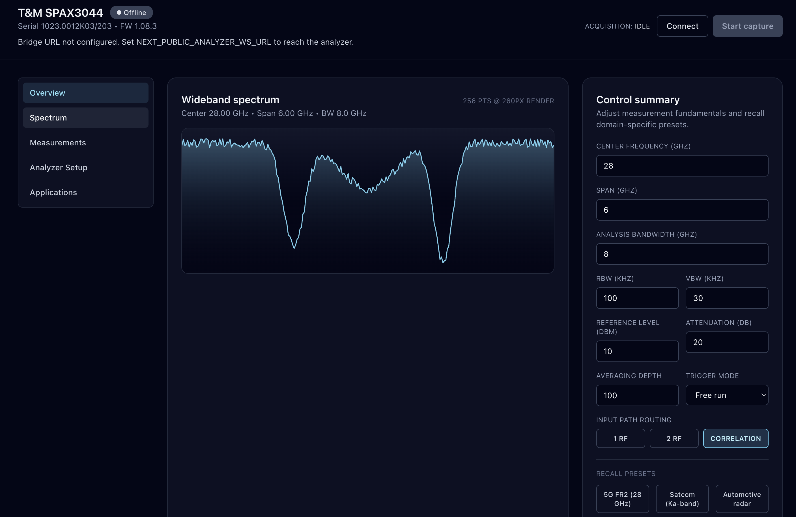
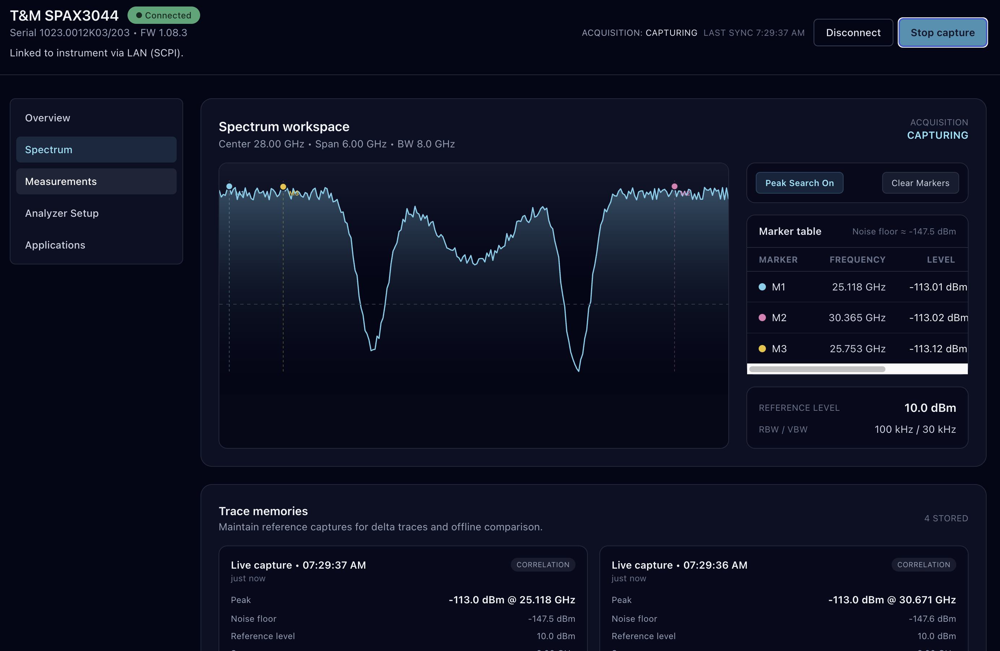
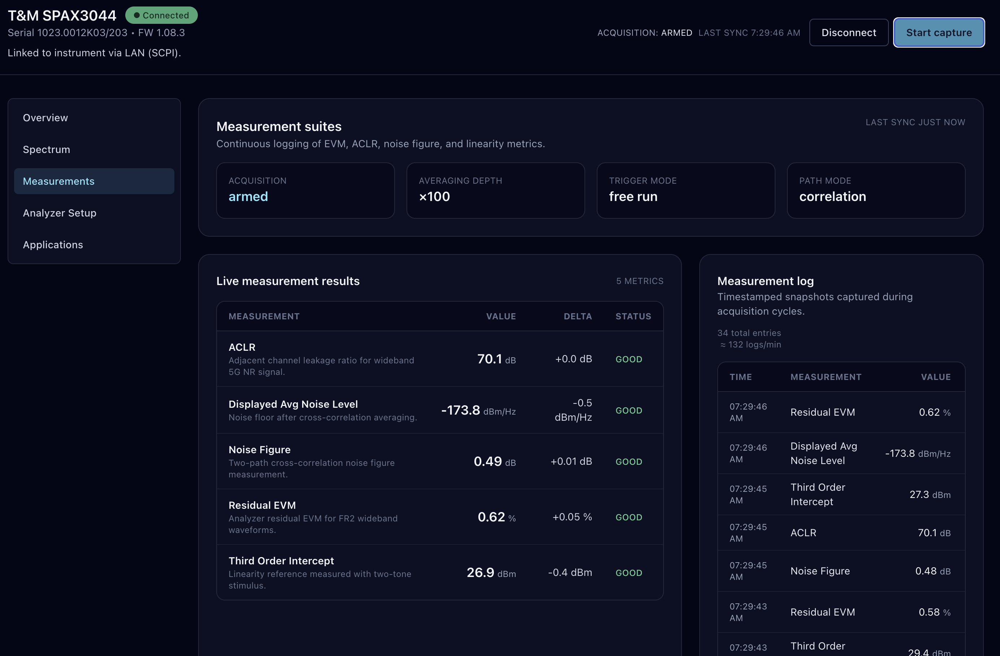
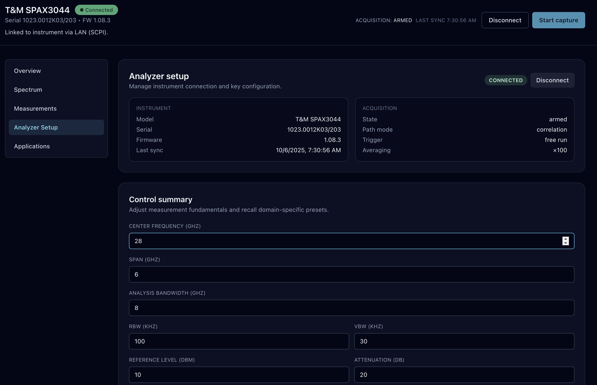
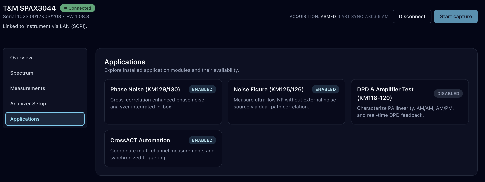
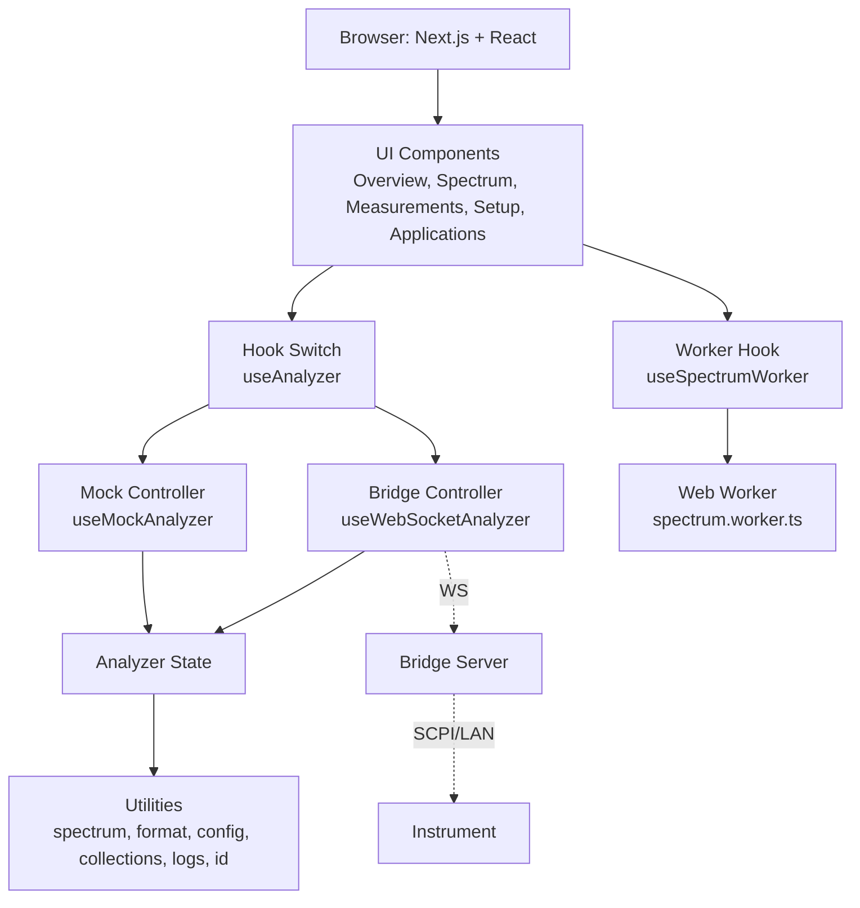

# NR5G Web UI (Spectrum Analyzer)

## Overview
- Next.js 15 + React 19 UI for a wideband spectrum analyzer demo (5G FR2 and dual‑path correlation).
- Runs out of the box with a realistic mock instrument. Optionally connects to a live analyzer via a lightweight WebSocket bridge when `NEXT_PUBLIC_ANALYZER_WS_URL` is set.

## Highlights
- Live wideband spectrum with peak markers and noise floor overlay.
- Marker controls: auto peak search, add/move/delete, SNR vs. noise floor.
- Trace memories with peak/floor and associated config snapshot.
- Measurements dashboard (EVM, DANL, TOI, ACLR, Noise Figure).
- Presets for 5G FR2, Satcom (Ka), Automotive Radar.
- 1RF / 2RF / Correlation path status and activity log.

## Screenshots






## Performance
- **C++ Native Addon**: Spectrum processing accelerated with native C++ code (5-10x faster than JavaScript)
- **Web Worker**: Computation offloaded to prevent UI blocking
- **Automatic Fallback**: Gracefully falls back to JavaScript if native addon unavailable
- **Smart Rendering**: Automatic switch from SVG to Canvas above 3k points (tunable)
- **SVG Overlay**: Markers remain interactive while Canvas renders the trace
- **Zero-Copy Transfer**: ArrayBuffer transfer for efficient data passing

## Tech Stack
- **Next.js 15** App Router (TypeScript) — `src/app`; dev uses Turbopack (`next dev --turbopack`)
- **React 19** — Concurrent-ready components
- **TypeScript 5** — Strict mode, `moduleResolution: bundler`, alias `@/*`
- **C++ Native Addon** — High-performance spectrum processing via N-API (`native/`)
- **Tailwind CSS v4** — Via `@tailwindcss/postcss`; theme in `src/app/globals.css`
- **Zod** — Runtime schema validation of bridge messages (`src/app/bridge/schema.ts`)
- **Web Worker** — Offloaded spectrum processing (`src/app/workers/spectrum.worker.ts`)
- **Canvas 2D** — Renderer for large traces (`src/app/components/spectrum/CanvasSpectrum.tsx`)
- **Vitest 2** — Unit/component tests with jsdom + Testing Library
- **ESLint 9** — With `next/core-web-vitals` + TypeScript rules

## Architecture


## Quick Start

### Prerequisites
- **Node.js 20+** and **npm 10+**
- **C++ Build Tools** (optional, for native addon):
  - macOS: `xcode-select --install`
  - Linux: `sudo apt-get install build-essential python3`
  - Windows: Visual Studio Build Tools

### Installation & Development
```bash
# Install dependencies (automatically builds native addon)
npm install

# Start development server
npm run dev

# Open browser
open http://localhost:3000

# Click Connect → Start capture
```

**Note:** If native addon build fails, the app automatically uses JavaScript fallback (slightly slower but fully functional).

### Connect To A Real Analyzer
Create a `.env.local` file:
```bash
NEXT_PUBLIC_ANALYZER_WS_URL=ws://192.0.2.10:9000
```

Restart the dev server. The UI automatically uses the WebSocket controller when this environment variable is set.

## Bridge Protocol
- Outbound (UI → bridge)
  - Handshake: {"type":"handshake","client":"nr5g-webui","version":"0.1.0"}
  - Acquisition: {"type":"command","command":"startCapture"|"stopCapture"}
  - Config patch: {"type":"config.update","payload": Partial<AnalyzerConfig>}
  - Preset recall: {"type":"preset.recall","preset":"5g-fr2"|"satcom"|"radar"}
- Inbound (bridge → UI)
  - Heartbeat: {"type":"heartbeat"}
  - Spectrum: {"type":"spectrum","payload": SpectrumTracePoint[]}
  - Measurements: {"type":"measurements","payload": AnalyzerMeasurement[]}
  - Config patch: {"type":"config","payload": Partial<AnalyzerConfig>}
  - Acquisition: {"type":"acquisition","payload":"idle"|"armed"|"capturing"}
  - State patch: {"type":"state","payload": Partial<AnalyzerState>}

Data Shapes
- Analyzer types: `src/app/types/analyzer.ts`
- Spectrum utils: `src/app/utils/spectrum.ts`
- Bridge schema (Zod): `src/app/bridge/schema.ts`

## Project Structure

```
nr5g-webui/
├── native/                      # C++ Native Addon
│   ├── addon.cpp               # N-API bindings
│   ├── spectrum.cpp/.h         # Core algorithms
│   ├── index.js                # JS wrapper
│   └── index.d.ts              # TypeScript definitions
├── src/app/
│   ├── page.tsx                # Entry point
│   ├── layout.tsx              # Root layout
│   ├── globals.css             # Tailwind styles
│   ├── components/             # React components
│   │   ├── DashboardPage.tsx
│   │   ├── SideNavigation.tsx
│   │   ├── overview/           # Overview view
│   │   ├── spectrum/           # Spectrum view + Canvas
│   │   ├── measurements/       # Measurements view
│   │   ├── setup/              # Setup view
│   │   └── applications/       # Applications view
│   ├── hooks/                  # React hooks
│   │   ├── useAnalyzer.ts      # Main controller
│   │   ├── useMockAnalyzer.ts  # Mock implementation
│   │   ├── useWebSocketAnalyzer.ts  # WebSocket bridge
│   │   └── useSpectrumWorker.ts     # Worker hook
│   ├── workers/                # Web Workers
│   │   ├── spectrum.worker.ts       # Main worker
│   │   └── spectrum.worker.types.ts # Shared types
│   ├── utils/                  # Utilities
│   │   ├── spectrum.ts         # Spectrum utilities
│   │   ├── spectrum-native.ts  # Native loader
│   │   ├── format.ts           # Formatting
│   │   └── ...
│   ├── types/                  # TypeScript types
│   ├── mock/                   # Mock data
│   └── bridge/                 # Bridge schema
├── tests/                      # Vitest tests
├── binding.gyp                 # node-gyp config
└── package.json
```

## Rendering & Worker Details
- SVG path rendering for traces < 3k points.
- Canvas renderer for larger traces; markers and interactions remain SVG overlay.
- Worker computes bounds and noise floor; in Canvas mode it also returns screen‑space coordinates as a `Float32Array` for fast drawing.
- Threshold is defined in `src/app/components/spectrum/SpectrumView.tsx` (`CANVAS_THRESHOLD`).

## Scripts

### Development
```bash
npm run dev              # Start dev server with Turbopack
npm run lint             # Run ESLint
npm test                 # Run tests once
npm run test:watch       # Run tests in watch mode
```

### Native Addon
```bash
npm run build:native         # Build C++ addon
npm run build:native:debug   # Build with debug symbols
npm run clean:native         # Clean build artifacts
```

### Production
```bash
npm run build            # Build native addon + Next.js app
npm start                # Serve production build
```

## Testing
- Run once: `npm test`
- Watch: `npm run test:watch`
- Single file: `npx vitest run tests/spectrum-utils.test.ts`
- Notes: Tests run in `jsdom` and don’t require the Next.js server to be running.

## Deployment
- Build with `npm run build`, then `npm start`.
- Provide `NEXT_PUBLIC_ANALYZER_WS_URL` in the environment if using a bridge.

## Troubleshooting

### Native Addon
- **Build fails**: See [NATIVE_ADDON.md](./NATIVE_ADDON.md#-troubleshooting) for platform-specific solutions
- **"Native addon not available"**: This is normal! App uses JavaScript fallback automatically
- **Performance issues**: Verify native addon is loaded with `native.isNativeAvailable()`

### Bridge Connection
- **"Bridge URL not configured"**: Add `NEXT_PUBLIC_ANALYZER_WS_URL` to `.env.local` and restart
- **No live spectrum**: Check browser console for WebSocket errors; verify bridge is sending `spectrum` and `heartbeat` messages
- **Connection drops**: Bridge may need auto-reconnect logic; check network tab

### UI Issues
- **Marker drag not working**: Ensure trace is present and drag within the plot area
- **Canvas not rendering**: Check browser console; verify points array is valid
- **Worker errors**: Check Web Worker support in browser (all modern browsers supported)

## Roadmap
- Waterfall view (time history heatmap) for spectrum activity.
- Trace modes: max/min/peak hold, averaged trace, optional smoothing.
- Marker math: delta markers, span/center drag, channel power region, export marker table.
- Export: screenshots (PNG/SVG), trace CSV, measurements CSV/JSON; copy to clipboard.
- Persistence: save/restore layout, markers, and presets; auto‑restore last session (localStorage).
- Bridge hardening: auto‑reconnect with backoff, ping/pong keepalive, schema versioning; optional binary `Float32Array` spectrum frames; clearer error reporting.
- Accessibility: keyboard navigation, focus states, high‑contrast and reduced‑motion support.
- Additional measurements: channel power, occupied bandwidth (OBW), spurious search; thresholds/alarms with bookmarking.
- Interaction: drag‑zoom box, scroll zoom, pan, zoom‑to‑fit, snapping to peaks.
- Performance: OffscreenCanvas + transferable buffers; consider WebGL path for very large traces; worker chunking.
- Testing/CI: Playwright end‑to‑end and visual snapshot tests; CI for lint/test/build; bundle size budgets.
- Internationalization (i18n) and RTL layout; theme customization.

## License
- No license specified.
